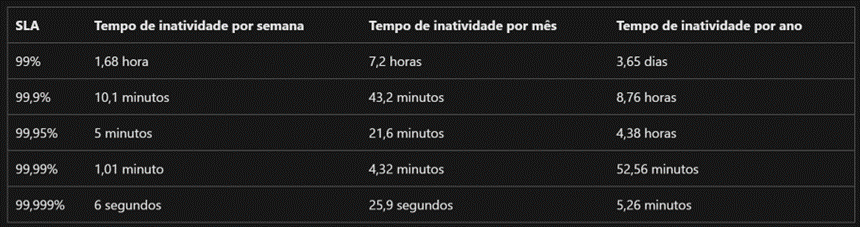
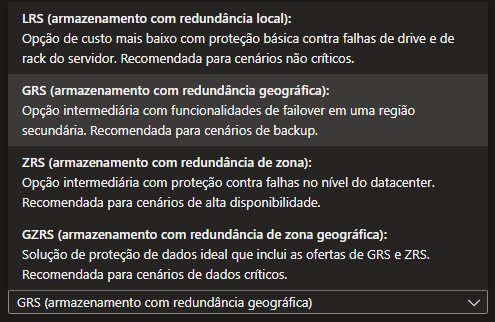

# Resumo da aula

## SLAs
Na aula foi apresentado sobre os SLAs disponíveis na núvem da Microsoft, o Azure.

No Azure, os **Acordos de Nível de Serviço (SLA)** definem os compromissos da Microsoft em termos de disponibilidade, desempenho e tempo de resposta de seus serviços. Eles garantem níveis mínimos de desempenho para assegurar a continuidade dos serviços críticos.

A Microsoft possui cinco opções de SLAs: 99%, 99,9%, 99,95%, 99,99% e 99,999%.

A diferença entre os SLAs de 99%, 99,9%, 99,95%, 99,99% e 99,999% está no tempo de disponibilidade garantido por cada nível, o que impacta diretamente o tempo de inatividade permitido por mês ou por ano. Esses percentuais indicam quanto tempo um serviço estará operacional e disponível, e quanto de inatividade é tolerada dentro de um período definido

**99% de SLA**: Disponibilidade: Garantia de que o serviço estará disponível 99% do tempo.
**Inatividade permitida**: Aproximadamente **7 horas e 18 minutos por mês**. Isso é aceitável para serviços que não exigem alta disponibilidade, como sistemas internos ou de desenvolvimento.

**99,9% de SLA**: Disponibilidade: Garantia de 99,9% de disponibilidade, conhecida como "três noves".
**Inatividade permitida**: Cerca de **43 minutos e 49 segundos por mês**. É o nível mínimo de SLA para muitos serviços críticos, como e-mails ou sites de negócios.

**99,95% de SLA**: Disponibilidade: Garantia de 99,95% de disponibilidade, com menos de 22 minutos de inatividade por mês.
**Inatividade permitida**: Aproximadamente **21 minutos e 56 segundos por mês**. Este SLA é comum para VMs e serviços que exigem alta disponibilidade.

**99,99% de SLA**: Disponibilidade: Garantia de 99,99% de disponibilidade, também conhecida como "quatro noves".
**Inatividade permitida**: Cerca de **4 minutos e 23 segundos por mês**. Este nível é recomendado para sistemas críticos, como plataformas de e-commerce e sistemas financeiros.

**99,999% de SLA**: Disponibilidade: Garantia de 99,999% de disponibilidade, também chamada de "cinco noves".
**Inatividade permitida**: Aproximadamente **26 segundos por mês**. Esse é um nível muito alto de disponibilidade, comum em infraestruturas de missão crítica, como data centers para serviços de emergência ou plataformas financeiras de alta demanda.

## Redundância de armazenamento
No Azure, a redundância ao criar uma conta de armazenamento refere-se ao modo como os dados são replicados para garantir alta disponibilidade e durabilidade. A redundância é serve para proteger os dados contra falhas de hardware, interrupções de serviços ou desastres naturais, garantindo que os dados salvos estejam sempre acessíveis. 

O Azure oferece diferentes opções de replicação, cada uma com suas características e níveis de proteção.

**LRS (Locally Redundant Storage)**
- Descrição: Armazena três cópias dos dados em uma única região (data center). A replicação é feita dentro de um único data center físico.
- Nível de proteção: Protege contra falhas de hardware no nível do servidor ou do disco dentro do data center.
- Cenário de uso: Ideal para cenários de baixo custo e dados que não exigem alta durabilidade fora de uma única região.
- Limitação: Não protege contra falhas ou desastres que afetam toda a região, como desastres naturais.

**GRS (Geo-Redundant Storage)**
- Descrição: Armazena seis cópias dos dados, com três cópias em uma região primária (como LRS) e três cópias adicionais replicadas em uma região secundária geograficamente distante. Se ocorrer uma falha na região primária, os dados podem ser recuperados da região secundária.
- Nível de proteção: Protege contra falhas e desastres que afetam uma região inteira, garantindo que os dados estejam disponíveis em outra região.
- Cenário de uso: Útil para cenários onde é necessária alta durabilidade dos dados, incluindo proteção contra desastres regionais.
- Limitação: A leitura dos dados replicados na região secundária só é possível após um failover (falha na região primária).

**ZRS (Zone-Redundant Storage)**
- Descrição: Armazena três cópias dos dados em diferentes zonas de disponibilidade dentro de uma mesma região (um conjunto de data centers independentes dentro da região). Cada zona é fisicamente separada e possui sua própria infraestrutura de rede e energia.
- Nível de proteção: Protege contra falhas de zona de disponibilidade, que podem ocorrer por problemas localizados, como falhas de energia em uma parte da região.
- Cenário de uso: Adequado para aplicações que exigem alta disponibilidade dentro de uma região e baixa latência no acesso aos dados.
- Limitação: Não protege contra falhas ou desastres que afetam toda a região.

**GZRS (Geo-Zone-Redundant Storage)**
- Descrição: Combina as vantagens do ZRS e do GRS. Armazena três cópias dos dados em diferentes zonas de disponibilidade na região primária (como ZRS) e replica os dados em uma segunda região geograficamente distante (como GRS), com mais três cópias.
- Nível de proteção: Oferece proteção contra falhas de zona de disponibilidade e desastres regionais, garantindo altíssima disponibilidade e durabilidade.
- Cenário de uso: Ideal para aplicações de missão crítica que exigem alta disponibilidade e proteção contra desastres em várias regiões.
- Limitação: Custo mais elevado, mas oferece o nível mais alto de proteção disponível.

| Tipo | Nível de Replicação | Proteção Oferecida | Cenário Ideal |
| ---- | ------------------- | ------------------ | ------------- |
| **LRS** |	3 cópias locais | Falhas no data center local | Dados com menor criticidade|
| **GRS** | 3 cópias locais + 3 em região distante | Desastres regionais | Alta durabilidade e recuperação de desastres|
| **ZRS** | 3 cópias em diferentes zonas na mesma região | Falhas de zonas de disponibilidade | Alta disponibilidade dentro da região|
| **GZRS** | 3 cópias em zonas + 3 em região distante | Falhas de zonas e desastres regionais | Missão crítica com altíssima disponibilidade|